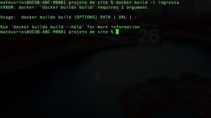
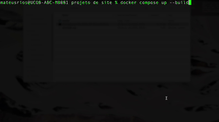
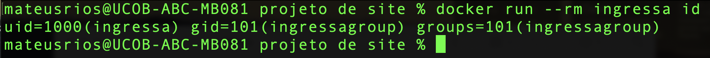
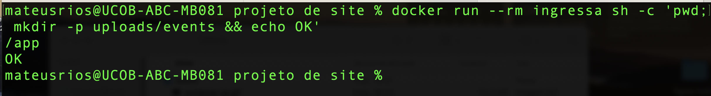
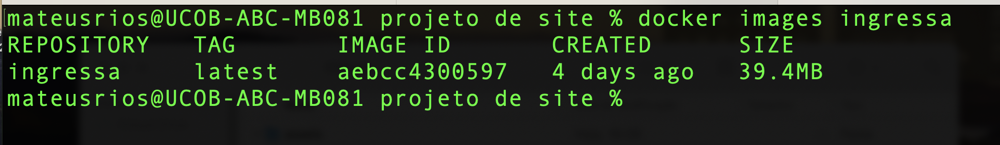

# Ingressa — Plataforma

Um **SaaS multi-tenant de inscrição para eventos**: gerencia eventos para cada
empresa que realiza o cadastro, com dashboard em tempo real, lista de inscritos,
relatórios, disparo de mensagens, pagamento de ingressos e check-in pelo celular
no local do evento.

> **Sobre este repositório.** Aqui está a **camada de infraestrutura** do
> Ingressa: como o sistema é empacotado, orquestrado e executado. O código-fonte
> da aplicação é privado (produto comercial em produção) — o que este repositório
> documenta é a engenharia de plataforma: build de imagem, isolamento de
> serviços, persistência, configuração e as decisões técnicas por trás de cada
> escolha.


---

## Sumário

- [Sobre o projeto](#sobre-o-projeto)
- [Demonstração](#demonstração)
- [Arquitetura](#arquitetura)
- [Stack](#stack)
- [Como o sistema sobe](#como-o-sistema-sobe)
- [Configuração](#configuração)
- [Decisões de engenharia (Docker)](#decisões-de-engenharia-docker)
- [Estrutura da aplicação](#estrutura-da-aplicação)
- [Roadmap](#roadmap)
- [Dívidas técnicas conhecidas](#dívidas-técnicas-conhecidas)

---

## Sobre o projeto

Um **SaaS multi-tenant de inscrições para eventos** (público-alvo: igrejas e
associações). Cada "tenant" (empresa/associação) tem sua própria conta, seus
próprios eventos, inscritos, configurações de pagamento e de e-mail — tudo
isolado dos outros tenants no mesmo banco de dados.

Fluxo de negócio central:
1. Uma empresa se cadastra (`/api/v1/auth/register`) e ganha um `tenant_id`.
2. Ela cria eventos, define lotes de ingressos (preço, capacidade, datas).
3. Publica um link público do evento; qualquer pessoa se inscreve sem login.
4. A inscrição pode gerar cobrança (Mercado Pago/Stripe) e dispara e-mails.
5. No dia do evento, a equipe faz check-in por QR Code.
6. A empresa acompanha tudo em um painel administrativo (dashboard, lista de
   inscritos, relatórios).

> Documentação detalhada de arquitetura e decisões de design:
> [`docs/ARQUITETURA.md`](./docs/ARQUITETURA.md)
> · Decisões em formato ADR: [`docs/decisions/`](./docs/decisions/)

---

## Demonstração

### Build da imagem (multi-stage)



Repare nos dois `FROM`: o primeiro estágio traz o compilador Go e compila; o
segundo começa do `alpine:3.20` e recebe apenas o binário pronto. A base
`golang:1.25-alpine` passa dos 300 MB e nada dela sobrevive ao segundo estágio —
por isso a imagem final tem 39,4 MB.

### Stack completa subindo



O `db` sobe primeiro e fica em `starting` até o `pg_isready` responder. Só quando
ele vira `healthy` é que o Compose libera o `app` — repare que a mensagem de
início do backend aparece **depois** disso. É o `depends_on: service_healthy`
evitando a corrida que antes derrubava a aplicação com `log.Fatalf`.

### Provas do que a imagem entrega

**1. O processo não roda como root.**



O container executa como `uid=1000(ingressa)`, não como `uid=0(root)`. Isso
importa porque o root de dentro do container é o **mesmo uid 0 do kernel do
host** — namespaces mudam o que o processo enxerga, não quem ele é. Se um dia
sair um CVE de escape no runtime de containers, escapar como uid 1000 limita
muito o estrago.

**2. E mesmo sem privilégio, consegue gravar onde precisa.**



Rodar sem privilégio só é útil se a aplicação ainda funcionar. O `pwd` confirma
que o diretório de trabalho é `/app`, e o `mkdir -p uploads/events` retorna `OK`
— é exatamente o que o handler faz ao receber a imagem de capa de um evento. Isso
funciona porque o Dockerfile cria `uploads/` com o dono correto **antes** de
trocar de usuário: `COPY` grava sempre como `root:root` e ignora o `USER`, então
sem o `mkdir`+`chown` explícito o upload falharia em produção.

**3. E a imagem final é enxuta.**



**39,4 MB** para uma aplicação Go com frontend embutido. Sem o multi-stage seriam
centenas de MB de toolchain que nunca são usados em runtime — peso a cada deploy
e superfície de ataque desnecessária.

### Persistência: os dados sobrevivem ao restart

<!-- TODO PRINT ③  ← salvar como: docs/img/volume-persistencia.png
     Sequência a capturar numa sessão só:
       1. docker compose up -d
       2. criar um registro no banco
       3. docker compose restart db
       4. mostrar que o registro AINDA ESTÁ LÁ
       5. (o contraste) docker compose down -v  → agora sumiu

     O passo 5 é o que demonstra que você entende a diferença entre
     `down` e `down -v`.
-->

---

## Arquitetura

```
                        docker compose up
                               │
        ┌──────────────────────┴───────────────────────┐
        │            rede default do Compose           │
        │                                              │
        │   ┌─────────────────────────────┐            │
  :8090─┼──▶│  app  (Go 1.25, net/http)   │            │
        │   │                             │            │
        │   │  mux "/"            → estáticos          │
        │   │  mux "/api/"        → API tenant         │
        │   │                       (AuthMiddleware)   │
        │   │  mux "/api/v1/dev/" → API DevOps         │
        │   │  mux "/media/"      → uploads            │
        │   │                             │            │
        │   │  usuário: ingressa (uid 1000)            │
        │   └──────────────┬──────────────┘            │
        │                  │ pgx pool                  │
        │                  │ host: "db"   porta: 5432  │
        │                  ▼                           │
        │   ┌─────────────────────────────┐            │
        │   │  db  (postgres:16-alpine)   │            │
        │   │  schema "main" + "logs"     │            │
        │   │  healthcheck: pg_isready    │            │
        │   └──────────────┬──────────────┘            │
        └──────────────────┼───────────────────────────┘
                           ▼
                 volume nomeado: db_data
              (sobrevive a down; só some com down -v)
```

**A decisão mais importante do diagrama:** a aplicação encontra o banco pelo
**nome do serviço** (`db`), não por `localhost`. Dentro da rede do Compose cada
serviço tem DNS interno, e a porta usada é a **interna** (5432), não a publicada.
Rodando fora do container, a mesma aplicação aponta para `localhost:15432` — é a
mesma imagem com configuração diferente, sem uma linha de código alterada.

---

## Stack

| Camada             | Tecnologia                          |
| -------------------| ----------------------------------- |
| Linguagem          | Go 1.25                             |
| Banco              | PostgreSQL 16                       |
| Driver DB          | pgx/v5                              |
| Geração SQL        | sqlc                                |
| Frontend           | HTML/CSS/JS estático (sem framework)|
| Container          | Docker (multi-stage) + Compose      |
| Criptografia       | AES-256-GCM (segredos por tenant)   |
| Autenticação       | JWT (golang-jwt/v5) + bcrypt        |
| Orquestração local | Docker Compose                      |
| Pagamentos         | Mercado Pago, Stripe                |
| E-mail             | SMTP (configurável por tenant)      |

---

## Como o sistema sobe

> **Esta é a entrega da Fase 2.** O objetivo: `docker compose up --build` sobe a
> aplicação **e** o banco do zero, sem nenhum passo manual.

> ⚠️ **Este repositório contém os arquivos de infraestrutura, não o código-fonte
> da aplicação.** Os comandos abaixo são os reais, executados no repositório
> privado do produto — estão documentados aqui porque as decisões que eles
> revelam são o conteúdo deste repositório. Um `docker compose up` aqui não vai
> encontrar o código Go para compilar.

### Pré-requisitos

- **Docker Engine 28+** (o Docker Compose v2 já vem embutido como `docker compose`)
- **Git**
- Porta **8090** livre na máquina (é onde a aplicação é exposta)

### 1. Configuração

```bash
cp .env.example .env
# edite o .env com os valores reais — nenhum segredo vive no repositório
```

### 2. Build da imagem

```bash
docker build -t ingressa .
```

O que acontece, em ordem:
- baixa a imagem base com o compilador Go (estágio `builder`)
- copia `go.mod`/`go.sum` e baixa as dependências — **antes** do código, para
  aproveitar cache
- compila o binário estático (`CGO_ENABLED=0`)
- começa o estágio final do zero, no `alpine:3.20`, cria o usuário `ingressa` e
  copia **só** o binário e o frontend
- resultado: imagem de ~39,4 MB, sem compilador

### 3. Subir a stack completa

```bash
docker compose up --build
```

- o banco inicializa e cria as 15 tabelas (schema via `initdb.d`)
- o healthcheck do Postgres fica `healthy`
- só então o app sobe e conecta
- a aplicação responde em **http://localhost:8090**

### Verificar que está no ar

```bash
curl -i http://localhost:8090
```

<!-- TODO: cole aqui o resultado esperado (HTTP 200) ou um print do terminal. -->

### Comandos úteis

```bash
docker compose up --build        # sobe app + banco (rebuild da imagem)
docker compose down              # para tudo (DADOS DO BANCO PERMANECEM)
docker compose down -v           # para tudo E APAGA o volume do banco
docker compose logs -f app       # acompanha os logs da aplicação
docker compose config            # mostra a configuração com as variáveis resolvidas
```

Para testar a criação do banco do zero é necessário apagar o volume
(`docker compose down -v`): o `schema_main.sql` é executado pelo Postgres apenas
quando o volume de dados está **vazio**, no primeiro boot. Com o volume
existente, o script é ignorado.

---

## Configuração

Nenhuma credencial vive neste repositório. O `docker-compose.yml` referencia
variáveis (`${DB_PASSWORD}`, `${DB_USER}`…) resolvidas a partir de um `.env`
local, que **não é versionado**. O [`.env.example`](./.env.example) documenta
quais variáveis existem, sem revelar nenhum valor.

| Variável             | Onde        | Descrição                                        |
| -------------------- | ----------- | ------------------------------------------------ |
| `DB_USER`            | `db` + `app`| usuário do Postgres                              |
| `DB_PASSWORD`        | `db` + `app`| senha do Postgres                                |
| `DB_NAME`            | `db` + `app`| nome do banco                                    |
| `DB_HOST`            | `app`       | `db` dentro do Compose; `localhost` fora dele     |
| `DB_PORT`            | `app`       | `5432` (porta interna do container)              |
| `DB_URL`             | `app`       | string de conexão, montada a partir das anteriores|
| `JWT_SECRET`         | `app`       | chave de assinatura dos tokens JWT               |
| `SETTINGS_ENC_KEY`   | `app`       | chave AES-256 dos segredos por tenant            |

> ⚠️ **`SETTINGS_ENC_KEY` não pode ser trocada depois que o sistema está em uso.**
> Ela cifra a senha de SMTP e o token do gateway de pagamento de cada tenant no
> banco. Trocá-la torna esses dados permanentemente indecifráveis. Já o
> `JWT_SECRET` pode ser rotacionado — o efeito é derrubar todas as sessões
> ativas, que é recuperável.

### Verificando que a configuração chegou até a aplicação

Declarar a variável não prova que ela é usada. A verificação é em quatro níveis,
cada um provando uma coisa diferente:

```bash
docker compose config                    # 1. o arquivo resolve as variáveis?
docker compose ps                        # 2. os serviços subiram? db está healthy?
docker compose exec app env | grep JWT   # 3. o PROCESSO recebeu o valor?
```

O quarto nível é o único que prova que a chave está de fato **assinando** — uma
rotação de segredo de ponta a ponta:

| Passo | Ação | Resposta esperada |
| ----- | ---- | ----------------- |
| 1 | Login e uso do token | `200` |
| 2 | Trocar `JWT_SECRET`, `docker compose up -d --force-recreate app`, reusar o **mesmo** token | `401` |
| 3 | Restaurar a chave real, recriar, fazer login **novo** | `200` |

O `401` do passo 2 é a evidência: a única coisa que mudou entre `200` e `401` foi
a variável de ambiente — logo, é ela que assina os tokens, não o valor embutido no
código. O passo 3 confirma que a rotação é reversível e que sessões novas voltam a
funcionar normalmente.

> `docker compose restart` **não** relê o `.env` — ele reinicia o processo com a
> configuração que o container já tinha. Só `--force-recreate` aplica variáveis
> novas.

---

## Decisões de engenharia (Docker)

- **Build multi-stage (`golang:1.25-alpine` → `alpine:3.20`).**

  **O problema:** pra compilar Go você precisa do compilador inteiro (~300+ MB de toolchain). Mas pra rodar o programa, você só precisa do binário final. Se você usasse uma imagem só, carregaria o compilador junto — imagem gorda e cheia de ferramentas que um atacante poderia usar.

  **O que eu fiz:**

  ```dockerfile
  FROM golang:1.25-alpine AS builder   # estágio 1: tem o Go completo
  RUN go build -o /app/servidor ...    # compila aqui

  FROM alpine:3.20                     # estágio 2: começa do zero, minúsculo
  COPY --from=builder /app/servidor .  # traz SÓ o binário do estágio 1
  ```

  **Por que resolve:**

  o estágio 1 é jogado fora no fim — só o `COPY --from=builder` sobrevive. A imagem final tem o binário + o alpine pelado (~39,4 MB), sem o Go.

- **Usuário não-root (`ingressa`, uid 1000).**

  **O problema:** por padrão, processo dentro de container roda como root. Se alguém explorar uma falha na sua aplicação, ganha root dentro do container — e isso facilita escapar pra máquina hospedeira.

  **O que eu fiz:**

  ```dockerfile
  RUN addgroup -S ingressagroup && adduser -S -G ingressagroup -u 1000 ingressa
  USER ingressa                        # daqui pra frente, roda como ele
  ```

  o `ingressa` é um usuário comum, sem poderes. Se a aplicação for comprometida, o atacante fica preso com privilégios mínimos. É o princípio do menor privilégio.

  O detalhe do `chown` na pasta uploads:

  ```dockerfile
  RUN mkdir -p uploads && chown ingressa:ingressagroup uploads/
  ```

  **Por que resolve:**

  Como o app roda como `ingressa` (não root), ele precisa ser dono da pasta onde grava arquivos, senão dá "permission denied" ao subir um upload.

  <!-- TODO: 1 frase sua sobre por que o root do container é o MESMO uid 0 do
       host — é o argumento que transforma esta decisão de "boa prática" em
       "eu sei por quê". -->

- **Healthcheck + `depends_on: condition: service_healthy`.**

  **O problema:** quando você sobe app + banco juntos, o container do Postgres inicia em segundos, mas o Postgres lá dentro demora mais uns instantes até aceitar conexões. Seu app tentava conectar antes disso e dava `log.Fatalf` — morria na largada. É uma condição de corrida.

  o `depends_on` "curto" (só `depends_on: db`) não resolve — ele só espera o container iniciar, não o Postgres ficar pronto.

  **O que eu fiz:**

  ```yaml
  db:
    healthcheck:
      test: ["CMD-SHELL", "pg_isready -U ${DB_USER} -d ${DB_NAME}"]
      interval: 5s
      retries: 5
  app:
    depends_on:
      db:
        condition: service_healthy    # só suba o app quando o db estiver SAUDÁVEL
  ```

  **Por que resolve:** o `pg_isready` fica perguntando ao Postgres "você já aceita conexão?" a cada 5s. Só quando ele responde "sim" (fica `healthy`) é que o Docker libera o app pra subir. A corrida acaba.

- **Volume nomeado `db_data`.**

  **O problema:** container é efêmero por natureza — quando você o destrói, tudo que estava dentro dele some. Se o banco guardasse os dados dentro do próprio container, todo `down` apagaria seus eventos e inscritos.

  **O que eu fiz:**

  ```yaml
  db:
    volumes:
      - db_data:/var/lib/postgresql/data   # os dados do Postgres moram AQUI

  volumes:
    db_data:                               # volume gerenciado pelo Docker
  ```

  **Por que resolve:** `/var/lib/postgresql/data` (onde o Postgres grava tudo) aponta pra um volume, que vive fora do ciclo de vida do container. Resultado:

  - `docker compose down` → destrói os containers, mas o volume fica → dados preservados.
  - `docker compose down -v` → o `-v` diz "apague os volumes também" → aí sim zera tudo.

- **Schema via `/docker-entrypoint-initdb.d/`.**

  **O problema:** um Postgres novo sobe vazio — sem suas tabelas. Alguém precisa criar as 15 tabelas e as extensões (`uuid-ossp`, `pgcrypto`). O app só faz migrações incrementais (`ALTER TABLE`), ele não cria o schema base do zero.

  **O que eu fiz:**

  ```yaml
  db:
    volumes:
      - ./internal/database/sql/schema_main.sql:/docker-entrypoint-initdb.d/schema_main.sql:ro
  ```

  **Por que resolve:** a imagem oficial do Postgres tem uma regra: qualquer `.sql` na pasta `/docker-entrypoint-initdb.d/` é executado automaticamente no primeiro boot. O `schema_main.sql` é montado lá (`:ro` = read-only, o Postgres só lê, não altera). Então, na primeira subida, ele cria todo o schema sozinho.

  **A pegadinha crucial:** isso roda só quando o volume está vazio (primeiro boot de verdade). Se você já subiu uma vez, o volume tem dados, e o Postgres ignora a pasta. Por isso, pra re-testar do zero, precisa `docker compose down -v` antes (apagar o volume → próxima subida é "primeiro boot" de novo).

- **`.dockerignore`.**

  **O problema:** quando você roda `docker build`, o Docker copia a pasta inteira do projeto (o "contexto de build") pra dentro do processo. Sem filtro, ele arrastaria `.git/`, a pasta `inspiracao/`, `scripts/`, e — pior — o `.env` com segredos.

  **O que eu fiz:**

  ```
  .git/
  inspiracao/
  scripts/
  .env
  *.env
  ```

  **Por que resolve:**

  - Build mais rápido/leve — não copia lixo pesado (o `.git/` sozinho pode ser enorme).
  - Cache estável — sem isso, **todo commit** alteraria o `.git/` e invalidaria a camada `COPY . .`, forçando recompilação mesmo sem mudança em código Go.
  - Segurança — o `.env` não vaza pra dentro da imagem. Se ele entrasse, qualquer um com a imagem poderia extrair as senhas com `docker history`.

- **Sem `ca-certificates` instalado, de propósito.**

  **O problema aparente:** a aplicação faz chamadas HTTPS de saída (Mercado Pago, Stripe, SMTP com TLS). Uma imagem sem store de certificados raiz falharia com `x509: certificate signed by unknown authority`.

  **O que eu fiz:** testei um build comparativo, com e sem `apk add --no-cache ca-certificates`. O TLS validou nos dois casos.

  **Por que resolve:** a base `alpine:3.20` já inclui `ca-certificates-bundle` — o arquivo com as raízes concatenadas, que é o que o Go procura. A linha custava 1,8 MB e não resolvia nada. Ela é obrigatória em `FROM scratch` e nas imagens `-slim` do Debian; nesta base, não.

---

## Estrutura da aplicação

> O código-fonte é privado. Este layout está aqui como contexto do que é
> containerizado — os diretórios abaixo **não** existem neste repositório.

```
cmd/api/main.go         → ponto de entrada: monta as rotas e sobe o servidor
internal/handler/       → um arquivo por área de negócio (events.go, lots.go,
                           inscriptions.go, payments.go, company.go, dev.go...)
internal/middleware/    → AuthMiddleware, DevAuthMiddleware, TenantMiddleware
internal/auth/          → geração/validação de JWT
internal/crypto/        → AES-GCM para segredos por tenant (senha SMTP, token de gateway)
internal/payments/      → abstração de gateway (Mercado Pago, Stripe)
internal/mailer/        → envio de e-mail via SMTP configurado por tenant
internal/database/      → conexão (pgx pool), auto-migrations, e código gerado pelo sqlc
  ├── sql/              → schema_main.sql, schema_logs.sql, query_*.sql (fonte da verdade)
  ├── dbmain/           → código Go gerado pelo sqlc a partir de schema_main + query_main
  └── dblogs/           → código Go gerado pelo sqlc a partir de schema_logs + query_logs
```

Os arquivos que **estão** neste repositório:

```
Dockerfile              → build multi-stage da imagem
docker-compose.yml      → orquestração app + Postgres
.dockerignore           → filtro do build context
.env.example            → contrato de configuração (sem valores reais)
docs/ARQUITETURA.md     → arquitetura detalhada do sistema
docs/decisions/         → ADRs (registros de decisão de arquitetura)
docs/img/               → evidências visuais
```

---

## Roadmap

- [x] **Fase 2 — Containerização** (Docker multi-stage + Compose)
  - [x] Imagem de produção enxuta (39,4 MB), usuário não-root
  - [x] Volume nomeado (dados sobrevivem ao restart)
  - [x] Healthcheck do banco antes da aplicação subir
  - [x] Schema inicial aplicado automaticamente no primeiro boot
  - [x] Senha do banco fora do código, via `.env`
  - [x] `JWT_SECRET` e `SETTINGS_ENC_KEY` injetados por ambiente, com rotação
        verificada de ponta a ponta
- [ ] Nginx como proxy reverso
- [ ] Backup automatizado do volume do Postgres
- [ ] CI/CD (build, testes, lint, `govulncheck`)
- [ ] Infraestrutura como código (Terraform: VPC, EC2, Security Groups, IAM, S3)
- [ ] Observabilidade (Prometheus/Grafana/Loki)
- [ ] `uploads/` em S3 (pré-requisito real para escalar horizontalmente)

---

## Dívidas técnicas conhecidas

- **Falha silenciosa de configuração.** As duas chaves de segurança são injetadas
  corretamente por ambiente, mas a aplicação ainda *aceita subir sem elas*,
  caindo num valor embutido no código em vez de recusar a inicialização. Compare
  com o `DB_URL`: configurado errado, ele derruba o processo em segundos e o erro
  é óbvio. Uma variável de segurança ausente passa despercebida — a aplicação
  funciona perfeitamente com um segredo conhecido. O comportamento correto seria
  falhar explicitamente no startup.
- Sem CI/CD, sem testes de integração com banco real.
- App não aplica o schema base sozinho fora do container (depende do `initdb.d`).
- RLS habilitado no schema mas inerte (conexão como owner do Postgres bypassa).
- Algumas telas de frontend são mockup estático, não conectadas à API:
  `gerenciamento-empresa*.html`, telas `dev-*`, e falta a página de check-in.
- WhatsApp não implementado (só e-mail).
- Fluxo público de pagamento na inscrição não conectado de ponta a ponta
  (checkout hoje é endpoint protegido, não plugado na tela pública de inscrição).
- Sem observabilidade real — hoje "métricas" são só as tabelas
  `apm_errors`/`system_logs` gravadas manualmente pela aplicação.
- `uploads/` é estado local no container: com mais de uma réplica, um upload
  feito numa instância não existe nas outras.

---

## Licença

Distribuído sob a licença MIT. Ver [`LICENSE`](./LICENSE).

A licença cobre os arquivos de infraestrutura e a documentação deste
repositório. O código-fonte da aplicação Ingressa é privado e não está incluído.
